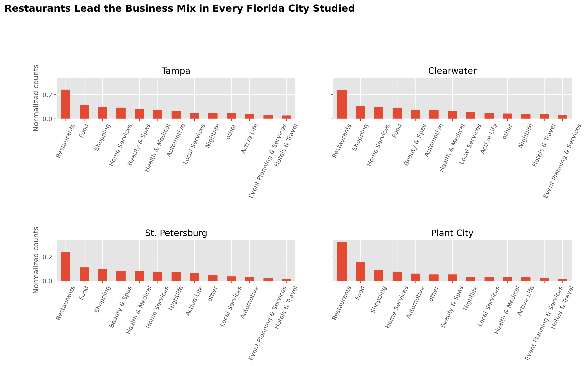
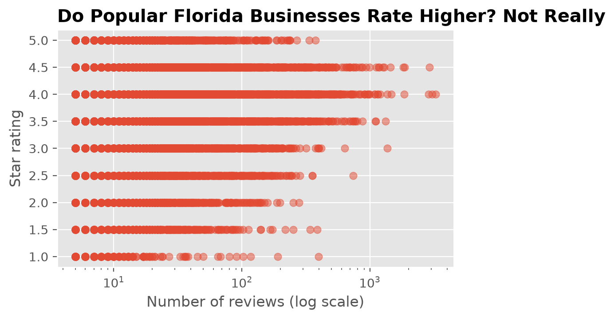

# 🏙️ Neighborhood Pulse

**What does a city's local business scene actually look like, once you chart it out?**

This project uses the business file from the Yelp Open Dataset (ratings, review counts, and categories for real businesses), filtered to Florida cities, to explore category mix, ratings, and review counts entirely through charts, with no modeling.

Built as a hands-on project to practice: Matplotlib chart types (bar, pie, scatter, histogram), plot customization, subplots, and Pandas–Matplotlib integration.

---





## 🎯 Project Questions

- Which business categories dominate each city?
- Do highly-reviewed businesses actually rate better, or is there no relationship?
- How are ratings distributed overall — clustered near 5 stars like most review platforms?
- (Stretch) How does the category mix compare across the largest cities?

## Findings

1. **Restaurants dominate:** Restaurants are the largest category in Tampa (2,187 businesses), Clearwater (528), St. Petersburg (282) and Plant City (84). Second place is Food in Tampa, St. Petersburg and Plant City, and Shopping in Clearwater.
2. **Category mix by city:** The mix is similar everywhere; the differences show up in ranks 4–5 (Home Services in Tampa, Clearwater and Plant City, Beauty & Spas in Tampa, Clearwater and St. Petersburg, Automotive only in Plant City).
3. **Review count vs. rating:** No meaningful relationship (Pearson r ≈ 0.07) — businesses with many reviews are not noticeably better or worse rated.
4. **Rating distribution:** share of businesses rated 4.0 - 4.5, and the most common rating

---

## 📁 Repository Structure

```
neighborhood-pulse/
├── data/
│   ├── raw/                # Yelp business JSON (untouched, git-ignored)
│   └── processed/          # Cleaned, analysis-ready business.csv
│
├── notebooks/               # Exploratory analysis, step-by-step, one notebook per phase
│   ├── 01_load_explore.ipynb
│   ├── 02_clean_data.ipynb
│   ├── 03_bar_pie_category.ipynb
│   ├── 04_histograms_scatter.ipynb
│   └── 05_subplots_dashboard.ipynb
│
├── src/                      # Reusable code, imported by notebooks/scripts (not copy-pasted)
│   ├── __init__.py
│   ├── clean.py              # City filter, missing values, primary category
│   └── analysis.py           # Answers to the project questions, saves charts
│
├── tests/                    # Unit tests for src/ functions
│   ├── __init__.py
│   └── test_clean.py
│
├── outputs/                  # Saved charts/plots (PNG)
│
├── .gitignore
├── requirements.txt
└── README.md
```

---

## 🛠️ Setup

```bash
git clone <your-repo-url>
cd neighborhood-pulse
python -m venv venv
source venv/bin/activate       # Windows: venv\Scripts\activate
pip install -r requirements.txt
```

Then download the Yelp Open Dataset from Yelp's dataset page and place
`yelp_academic_dataset_business.json` in `data/raw/`.

> The file is large and Yelp's terms restrict redistributing the dataset, so add
> `data/raw/` to `.gitignore` and don't commit it.

---

## 🚀 Usage

1. **Add the data** — put `yelp_academic_dataset_business.json` in `data/raw/`
2. **Clean & engineer features** (filters to Florida cities, adds the primary category, fills `data/processed/`)
   ```bash
   python -m src.clean
   ```
3. **Run the analysis** (prints the results and saves the charts to `outputs/`)
   ```bash
   python -m src.analysis
   ```
4. **Explore in notebooks**, in order, starting with `notebooks/01_load_explore.ipynb`

---

## 📊 Skills Practiced

| Skill                                                 | Where                                                 |
| ----------------------------------------------------- | ----------------------------------------------------- |
| Filtering, `groupby`, `value_counts`                  | `notebooks/01`–`02`, `src/clean.py`, `src/analysis.py` |
| Cleaning text categories with `.apply()`              | `notebooks/02`, `src/clean.py`                        |
| Plot customization, labels, grid lines                | every notebook, `src/analysis.py`                     |
| Bar charts, pie charts                                | `notebooks/03`, `src/analysis.py`                     |
| Scatter plots, histograms                             | `notebooks/04`, `src/analysis.py`                     |
| Subplots (combined dashboard, per-city grid)          | `notebooks/05`, `src/analysis.py`                     |
| Pandas + Matplotlib integration (`.plot()`, `ax=`)    | `notebooks/03`–`05`, `src/analysis.py`                |
| Correlation                                           | `src/analysis.py`                                     |

---

## 📈 Sample Finding

> Review count and rating are essentially uncorrelated (Pearson r ≈ 0.07): how many reviews a Florida business has tells you almost nothing about its star rating.

---

## 📄 Data Sources

- Business data: the **Yelp Open Dataset** (free, official, downloadable JSON, no scraping needed)
  - `yelp_academic_dataset_business.json` — one row per business: name, city, categories, stars, review count, open/closed, and more
  - Filtered by city name against a list of 47 Florida cities; only 11 appear in the data and Tampa holds most of the rows, so small-city results are anecdotal. A few names (e.g. Titusville, Hollywood) also exist in other states.
  - Primary category = the first match from a fixed list of 12 categories, otherwise "other", so the order of that list affects the rankings.

---

## 🔭 Possible Extensions

- Filter on the dataset's state column instead of matching city names
- Use a rank-based (Spearman) correlation for the skewed review counts
- Compare two neighborhoods or cities side by side with matched chart styling
- Turn `outputs/` into an actual one-page PDF report